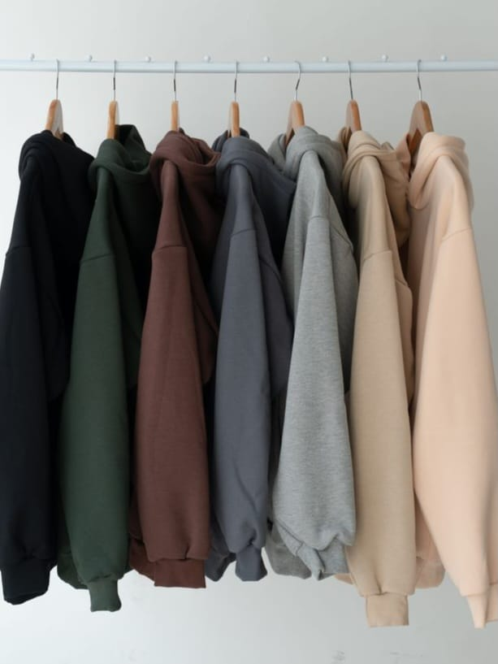

# AURA Store 🧥

A modern, responsive, and bilingual e-commerce storefront for a hoodie brand, built with pure HTML, CSS, and JavaScript. This project demonstrates core front-end development principles without relying on any frameworks.

---

### ✨ Core Features

*   **Fully Bilingual:** Seamlessly switch between Arabic (RTL) and English (LTR) with a single click.
*   **100% Responsive:** Flawless viewing experience on all devices, from large desktops to small mobile phones.
*   **Dynamic Product Loading:** Products are dynamically rendered from a JavaScript state object.
*   **Interactive Product Pages:** Users can select sizes before adding items to the cart.
*   **Complete E-commerce Flow:**
    *   Home page with a hero section and product grid.
    *   Detailed product pages.
    *   Functional shopping cart with add/remove/update logic.
    *   Multi-step checkout process (Cart -> Shipping Details -> Success).
*   **Local Storage Persistence:** The user's language preference and shopping cart contents are saved in the browser, so they persist between sessions.
*   **Modern UI/UX:** Clean design, smooth animations, and intuitive user interactions inspired by leading e-commerce platforms.

### 🛠️ Tech Stack

*   **HTML5:** For semantic and accessible page structure.
*   **CSS3:** For modern and responsive layouts, featuring Flexbox, Grid, and custom properties (variables).
*   **Vanilla JavaScript (ES6+):** For all client-side logic, state management, and DOM manipulation. No frameworks, no libraries.

---

This project was a fantastic exercise in building a complete, feature-rich application from the ground up using only web fundamentals.
